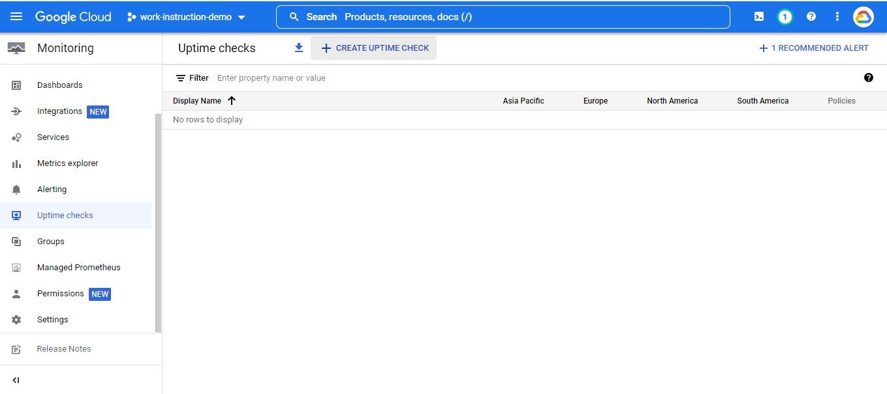
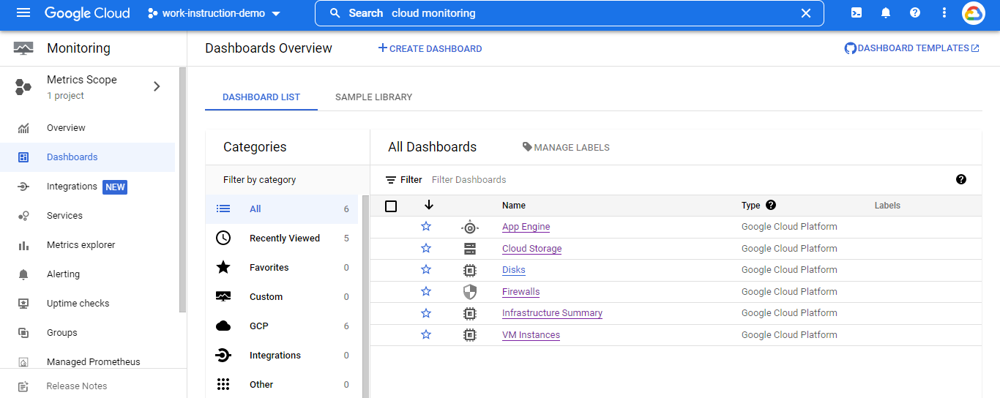

# Google Cloud Platform

## Work Instruction for Using Cloud Monitoring

1. Before we run cloud project, we need create VM which will be monitored.  
    

2. Then connect to the vm, and run web server (I am using apache web server).
   Run this command :
   “sudo apt-get install apache2”
    

3. Run this command for install agent to the vm :
   “curl -sSO https://dl.google.com/cloudagents/install-monitoring-agent.sh”
    

   “sudo bash install-monitoring-agent.sh”
    

4. Run this command for install cloud log to the vm :
   “curl -sSO https://dl.google.com/cloudagents/install-logging-agent.sh”
   “sudo bash install-logging-agent.sh –structured”
    

5. The we configure the Cloud Monitoring.
   Go to App Cloud Monitoring menu, and choose Metrics Scope. 
    

6. This view mean, your project was detected by cloud monitoring. But if you want add another project to monitor, you can click “Add Cloud Projects to metrics scope”.
    

Create Uptime Check and Alert.

7. Go to uptime check menu.
    

8. Then create uptime check.
    

9. Fill the title, etc as you want, but you can follow this option.

10. Title.
    

11. Terget
    

12. Response Validation
    

13. Alert & Notification. 
    Click manage notification channel. New tab will be opened.
     

14. Choose email and click add new (you can choose other than email)
     

15. Fill your email and display name what you want. Then click save.
    

16. Go back to uptime check menu, and click refresh.
    

17. You can see, the channel was displayed, then choose that and click ok.
    

18. After that, we test the check.
    

19. If the respond is “200” it mean test be succeed. Then click create.
    

20. Wait a few minutes, until uptime check success to be created. Uptime check was created.
    
    

Simulation Condition if your VM gonna be stop.

21. Go to compute engine and stop the vm.
    

22. You will be receive the alert email notification that your vm stoped. Check your email.
    

Simulation Condition if your VM gonna be startup again.

23. Go to compute engine and start the vm.
    

24. You will be received the alert email notification that your vm is running. Check your email.
    

Custom your dashboard and charts.

25. Go to cloud monitoring dashboard menu and click create dashboard.
    

26. Follow the instruction, and fill what you want.

27. Name
    

28. Chart
    

29. You can choose your chart you want. I am using line for this.
    

30. You can choose any option for resource monitoring. For this I am using cpu utilization for display mean cpu utilization with 1 minute interval.
    

31. You can add another matric, just click it.
    

32. I add another metric for display disk read byte.
    

33. Done, Thanks.
